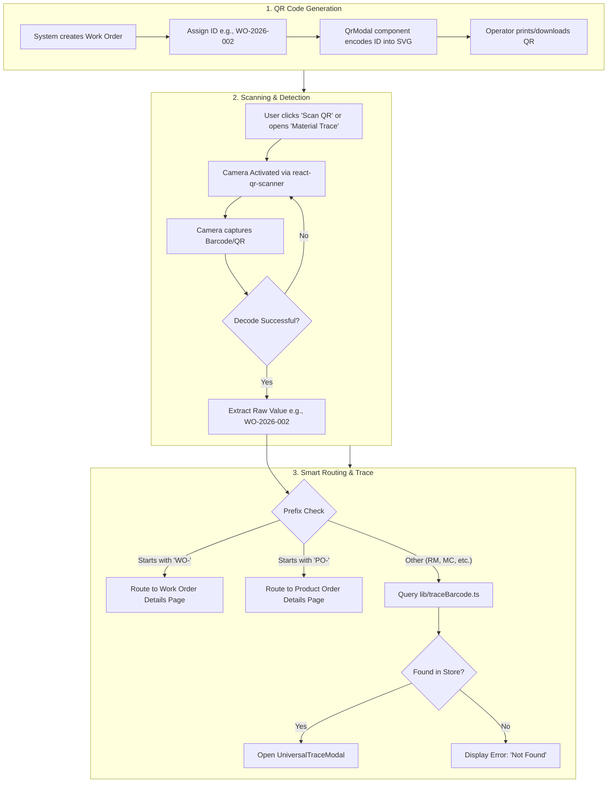

# Capco QR Code & Traceability Flow

This document outlines the end-to-end architecture of the QR Code system within the Capco application. It details how QR codes are generated, how they are scanned via the device camera, and the smart routing logic that decides what happens after a successful scan.

---

## 1. High-Level Process Flow

The system supports a full closed-loop traceability process. Items (Work Orders, Product Orders, Raw Materials) are assigned unique IDs which are encoded into QR Codes. When scanned by an operator, the system intelligently determines the context of the ID.



---

## 2. Code-Level Implementation

### A. QR Code Generation
QR Codes are generated entirely on the client side using the `qrcode.react` library.

**Key File:** `app/store-head/workorder/page.tsx` (and `components/QRCodeModal.tsx`)
**Component:** `QrModal`

**How it works:**
1. The component receives an identifier prop (e.g., `workOrderId="WO-2026-002"`).
2. It renders `<QRCodeSVG value={workOrderId} size={180} level="M" />`.
3. **Downloading:** The `handleDownload` function clones the SVG node, serializes it to an XML string, draws it onto an invisible HTML5 `<canvas>`, and converts it to a PNG Blob. This allows the user to download a high-quality, printable PNG of the QR code.

### B. QR Code Scanning (Camera Integration)
The scanning capability is powered by `@yudiel/react-qr-scanner`, which hooks into the device's native BarcodeDetector API (with a ZXing WASM fallback).

**Key File:** `app/person-a/workorder/page.tsx` (and `UniversalTraceModal.tsx`)
**Component:** `ScannerModal` / `Scanner`

**How it works:**
1. The camera is constrained to the rear-facing lens using `constraints={{ facingMode: "environment" }}`.
2. The `formats` array constraint was explicitly removed to allow aggressive auto-detection of all barcode types.
3. When a code is detected in the frame, the `onScan` callback is fired with an array of `IDetectedBarcode` objects.
4. A `scanLockRef` (React `useRef`) is used to debounce the scanner, ensuring that a single QR code isn't processed 50 times in one second.

```typescript
const handleScan = useCallback((detectedCodes: IDetectedBarcode[]) => {
  if (scanLockRef.current) return; // Prevent rapid-fire scanning
  const rawValue = detectedCodes[0]?.rawValue;
  if (!rawValue) return;

  scanLockRef.current = true; // Lock the scanner
  onTrace(rawValue); // Pass to the routing engine
}, []);
```

### C. Smart Routing Logic
Once the scanner extracts the raw string (the ID), the parent component determines the user's intent based on the ID's prefix.

**Key File:** `app/person-a/workorder/page.tsx`

**How it works:**
Instead of blindly opening a modal for every scan, the `onTrace` callback uses intelligent routing to navigate the user to dedicated detail pages when appropriate.

```typescript
onTrace={(id) => { 
  setIsScannerOpen(false); // Close the camera

  if (id.startsWith('WO-')) {
    // Navigate directly to the Work Order detail view
    window.location.href = `/person-a/workorder/${id}`;

  } else if (id.startsWith('#PO-') || id.startsWith('PO-')) {
    // Clean the ID and navigate to Product Order detail view
    const cleanId = id.startsWith('#') ? id.substring(1) : id;
    window.location.href = `/person-a/product-orders/${cleanId}`;

  } else {
    // For Raw Materials or sub-components, open the Trace Modal
    setTraceId(id); 
  }
}}
```

### D. The Traceability Engine
If the scanned ID is not a top-level order (e.g., it is a Raw Material like `RM-8301`), the system executes a deep trace to map its entire lineage.

**Key File:** `lib/traceBarcode.ts`

**How it works:**
1. The `traceBarcode(store, barcodeId)` function acts as a query engine against the global Zustand `store`.
2. **Identification:** It loops through `mockMaterials`, `mockWorkOrders`, and `mockPurchaseOrders` to find the exact entity.
3. **Ancestry (Parent Chain):** If a Raw Material is found, it recursively looks for any Work Order that consumed it. Then it looks for any Product Order that consumed *that* Work Order.
4. **Descendants (Children):** It searches for any output batches, sub-rolls, or byproducts generated from the scanned entity.
5. The final resulting `TraceResult` object is passed into the `UniversalTraceModal`, which visually renders the hierarchy using `EntityCard` components.
